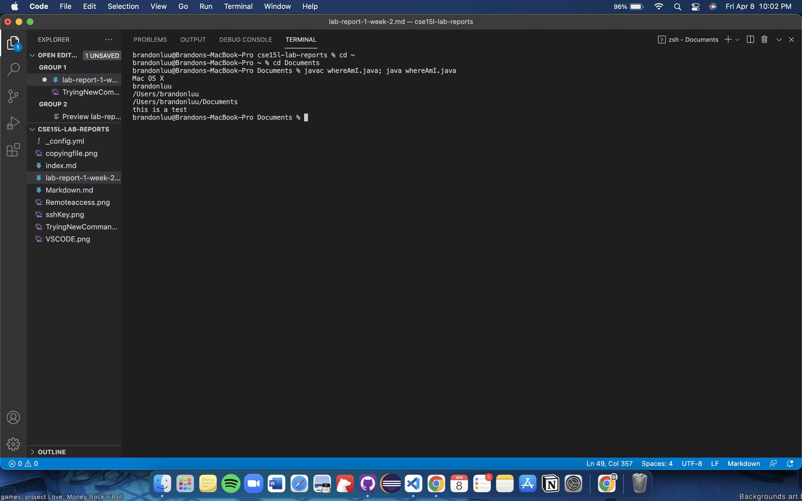

# Lab report 1 Week 2 

### How to remotely connect to a course specific account on ieng6 (For MacOS)

#### **Part 1**: 
The first thing to do is to download [VSCode](https://code. visualstudio.com/download) or install an IDE with a terminal

* After downloading it, open it and it should look something like this:

There is a built in terminal in VScode, which can be opened by going to terminal -> new terminal. This will be used in order to remotely access the ieng6 server. 

#### **Part 2**: 
After installing the IDE, Lookup your ieng6 account [here.](https://sdacs.ucsd.edu/~icc/index.php) You may need to update your password so you can access the server. Go to the terminal and type in the command 'ssh cs15lsp22xxx@ieng6.ucsd.edu where xxx is a unique to you. There will be a password prompt where you enter your password. 

Note: there is no password prompt because there is an ssh key that automatically allows access (this will be covered later). 

#### **Part 3**:

After you have successfully connected to the secure remote server, you can manipulate the files with various commands. Some of the commands include ( *cd ~ *, *ls*, *cd*, *mv*, *cp*)

#### **Part 4**:

In order to move a file from the local (your computer) to the remote server, you have to use the command *scp*. In order to do so, go to the console on your device and type in *scp <file name\> cse15lsp22xxx@ieng6.ucsd.edu:\~/*

#### **Part 5**:

Typing in the password when logging in to the secure server can be tedious, so we will generate a public ssh key to copy to the server to bypass this. To do so, type in the command *ssh-keygen* on the local terminal and answer the prompt with */Users/USER-NAME/.ssh/id_rsa*. **Leave the passphrase prompt empty so you do not have to type a password** and then make a new .ssh directory in the remote server and copy the **public** key to the server. 

#### **Part 6**:

It is possible for you to run multiple commands on one line of code on the terminal. For example, you can do *ssh cs15lsp22aet@ieng6.ucsd.edu "cat OtherMain.java"* to revela the contents of the file and then exit. You are also able to use semicolons to run multiple commands like *javac OtherMain.java; java OtherMain.java; to compile and then run a file. 

