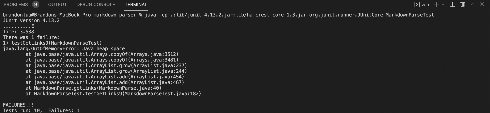
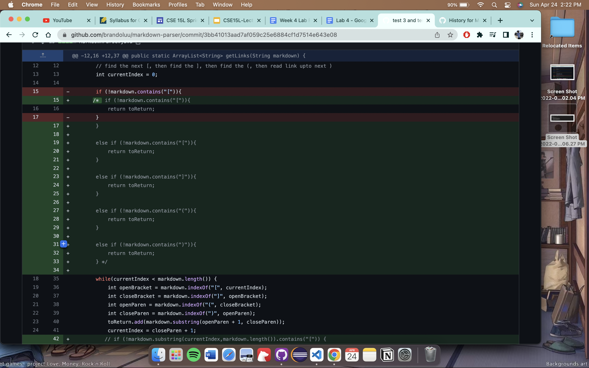
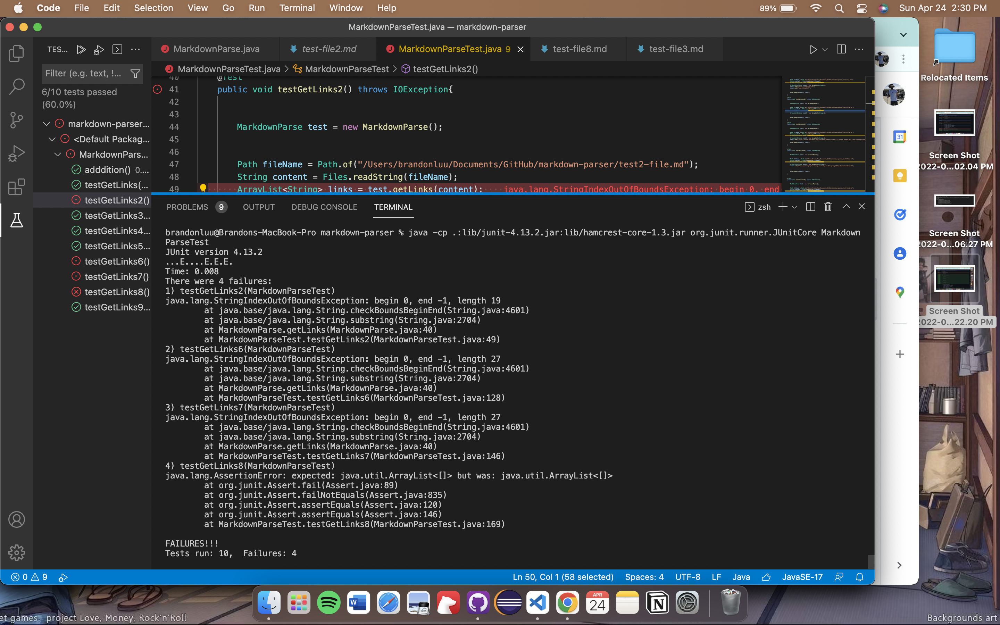
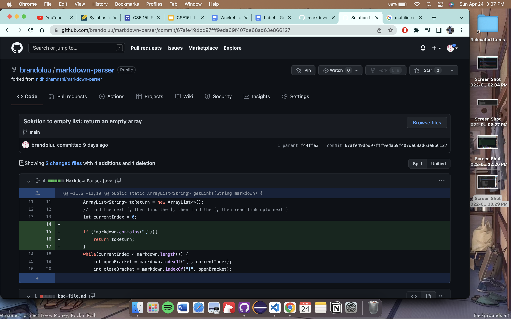
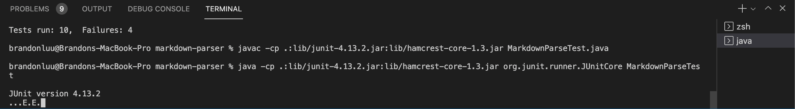

# Lab Report 2 Week 4 

### debugging the Markdown Parse method

* **Code Change #1:**

 

For this code change, there was an error in the implentation that caused an infinite loop. In the [test2.md](https://github.com/brandoluu/markdown-parser/blob/main/test-file2.md) file, there is an error in the implementation that gives the following result: 

The symptom that comes from this bug is that there is no more heap space, which means that there is an infinite loop that keeps on going until there is no more memory. This big is likely due to the implementation not checking if there is a 
*[* or a *]* and stopping when the bracket is found.  

* **Code Change 2**

This image shows the addition of more if statements that check for the *[*, *]*, *(*, and *)* in a markdown file before the while loop in order to make sure these are present in the file. Prior to this, there was an error in the [test file](https://github.com/brandoluu/markdown-parser/blob/main/test-file7.md) that gave this result: 

This image shows that 4 of the test files have an error. The bug in this code creates a symptom where there is an out of bounds error when finding the index of the bracket characters. 

* **Code Change 3**

This image shows a portion of the code where an empty array list will be returned if the brackets are not in a md file. This leads to the follwing error:

The symptom that results from the bug is that there is an infinite loop that does not finish the implementation. This symptom comes from a bug that loops through and looks for a closed bracket. In the case there is not a bracket in the md document, the code will constantly loop through the file. 

