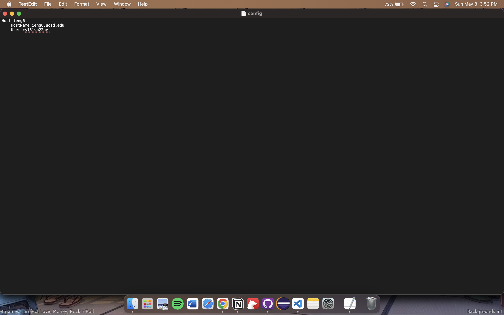

# Lab Report 3 Week 4 

### Part 1: Streamlining ssh configuration:

this text for the config file was added using TextEdit, a built in apple app. 

As we can see, we are not required to type the whole ssh command to sign into the remote server. 

Using this allows us to save time typing out the long command to sign into the remote server. 

### Part 2: Github Access from ieng6 server:

This is the key to the remote server that was added to the github account. 

This is the location of the public and the private key on the local machine. 

Since the ssh key was added to the github account, it is possible to do things such as delete photos and commit those changes to the main.

### Copy whole directories with scp -r:

The follwing photo shows a recursive copy of the mardown-parse directory into the remote server

This photo shows the jUnit tests being run on the markdownTest file in the remote server

These two photos show the recursive copy and the jUnit tests being ran in one line in the terminal. First the direcotry is copied into the remote server then run in the server. 
