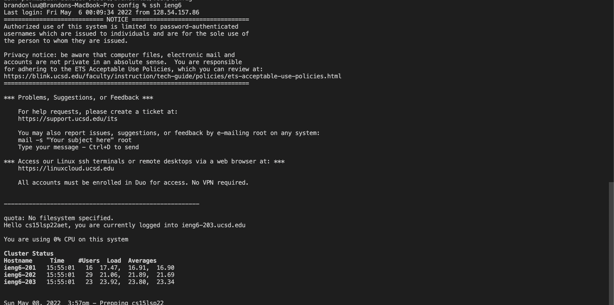

# Lab Report 3 Week 4 

### Part 1: Streamlining ssh configuration

this text for the config file was added using TextEdit, a built in apple app. 

As we can see, we are not required to type the whole ssh command to sign into the remote server. 

Using this allows us to save time typing out the long command to sign into the remote server. 

### Part 2: Github Access from ieng6 server

This is the key to the remote server that was added to the github account. 

This is the location of the public and the private key on the local machine. 

Since the ssh key was added to the github account, it is possible to do things such as delete photos and commit those changes to the main. The link to the actual commit can be found [here]()

