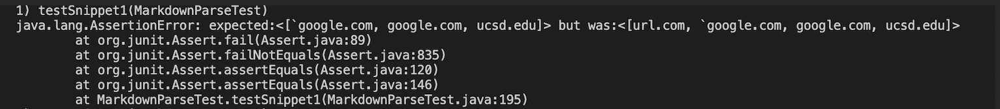
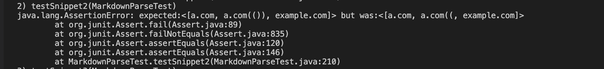
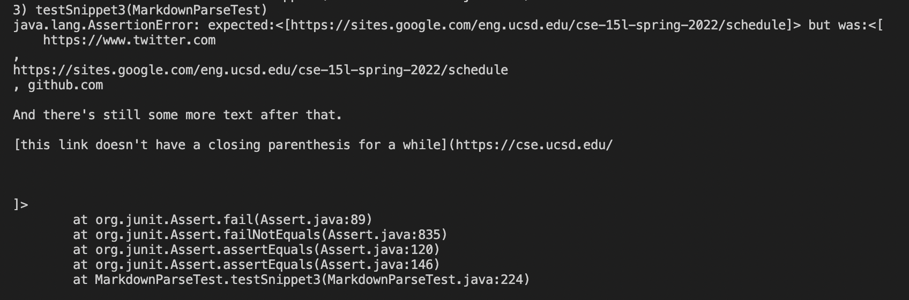

# Lab 8 Week 4 Lab Report

### Repositories of the two MarkdownParse implemnetations that will be tested:
* [My implementation](https://github.com/brandoluu/markdown-parser)
* [Implementation of one I reviewed](https://github.com/ohuynh21/markdown-parser)

### Test 1: 
By using the [commonMark demo test](https://spec.commonmark.org/dingus/), the expected result for snippet 1 is an array with `google.com, google.com, and ucsd.edu. 

My implementation:

Implementation I reviewed: 

For my implementation, I do not think there is a small code change that can make the implementation work for inline code. The logic for this code is to check if there is a bracket, and then parse the word that is between the seuqential parenthesis, so the entire logic would have to be modified in order for it to work for this snippet. 

### Test 2: 
Using the same test site, the expected result for snippet 2 is an array with a.com, a.com(()), and example.com

My implementation:

Implementation I reviewed: 

A small code change that I could do is to add a line of code that checks for the closing parenthesis on the far right and then using that as the right parse. Doing this would allow for nested parenthesis in the loop.

### Test 3: 
Using the same test site, the expected result for snippet 3 is an array with https://sites.google.com/eng.ucsd.edu/cse-15l-spring-2022/schedule in the array. 

My implementation:

Implementation I reviewed: 

I do not beleive that a small code change would be effective, since the code seems to be failing with the line break. Because of this, the entire implementation would have to be changeed in order to account for a line break and still track the opening and closing parenthesis. 