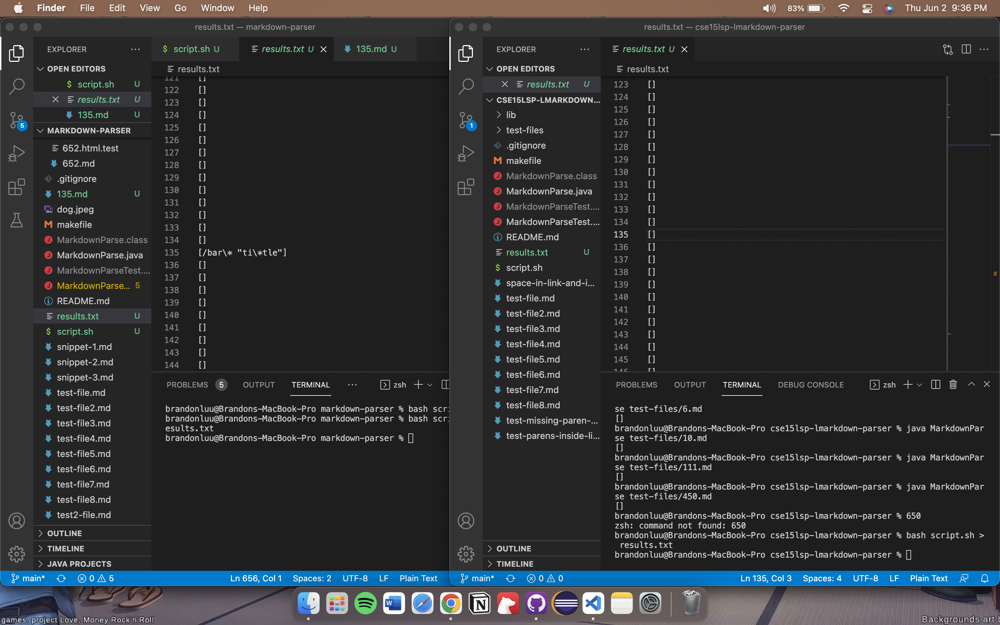
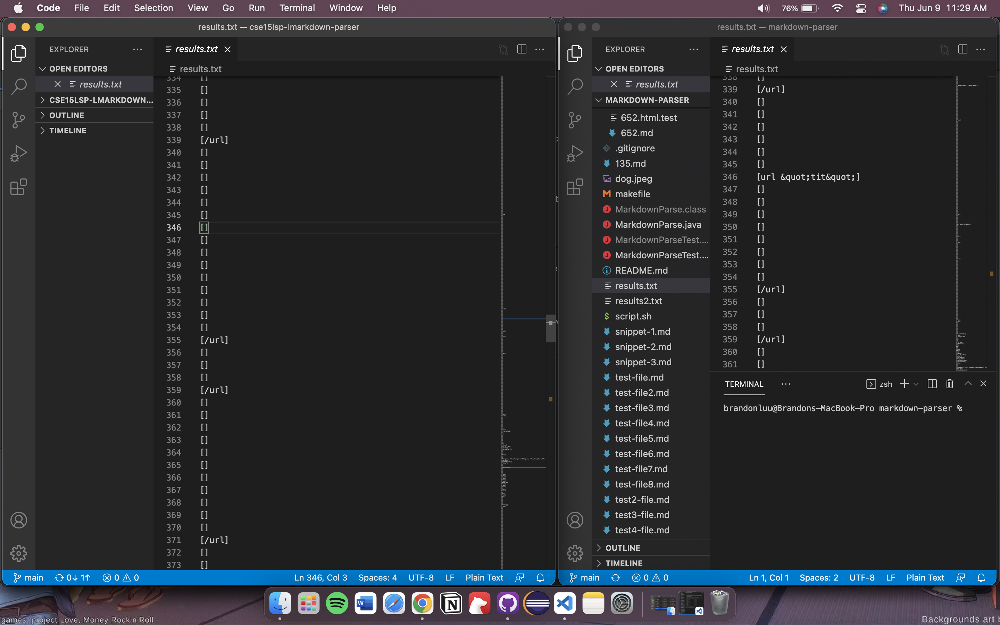
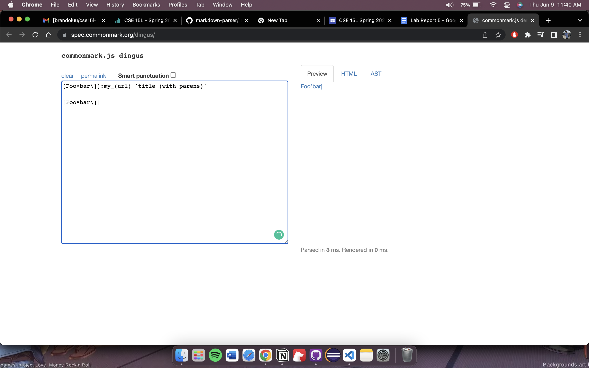
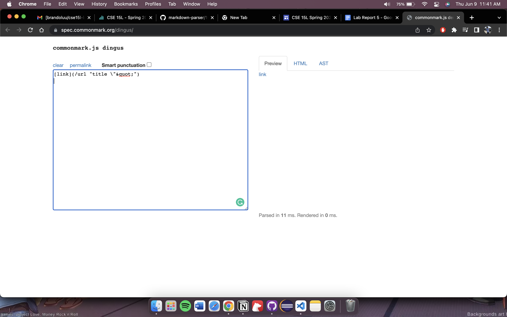
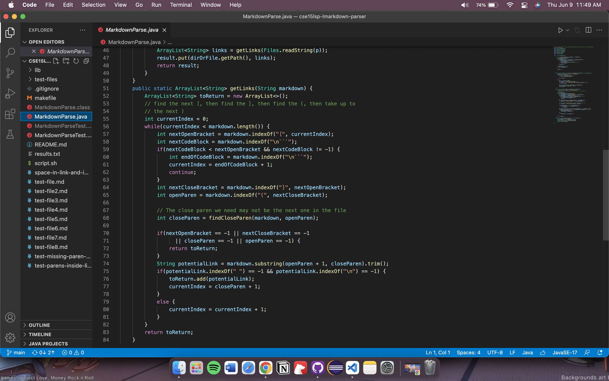

# Lab Report 5 Week 10

### Comparing two different outputs from personal MardownParser and the MarkdownParser given:

There were two tests that produced different results as seen here: 

>note: the differece for the second image is on line 346

This was found by using the bash script and putting the output onto a new text file titled *results.txt*. For test file 194, the personal MarkdownParser returned an array with one value and the other did not. In test file 505, the personal MarkdownParser returned another array while the other one did not. 

> Note: the two images come from the file 505.md and 194.md. test 505.md can be found [here](https://github.com/brandoluu/markdown-parser/blob/main/test-files/505.md) and 194.md can be found [here](https://github.com/brandoluu/markdown-parser/blob/main/test-files/211.md). 

The output for the two markdown files are:

As seen from the two images,the first image shows that there is a link, however it is invalid. Therefore there is a bug in the personal markdownParser. However there is also a bug in the other markdownParser becuase the second image shows a valid link with parenthesis, and the other Parser did not conisder it valid. The two images show that there are bugs in both implementations of markdownParser. 

### Analyzing the bug in the code:
----------
As mentioned previously, there is a bug in both of the markdownParsers. Focusing on the other markdownParser, there seems to be bug where the inside of the parentheiss of a link is not taken sometimes.

This is possibly due to the implementation not checking if there is a valid link in the markdown parser. A solution that may fix this bug is to first check the markdown file to see if it contains the correct brackets needed. Then check if the order of the brackets are correct. After these conditions are fufilled then the link is valid and the contents of the link are added to the list. 

